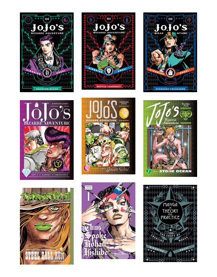
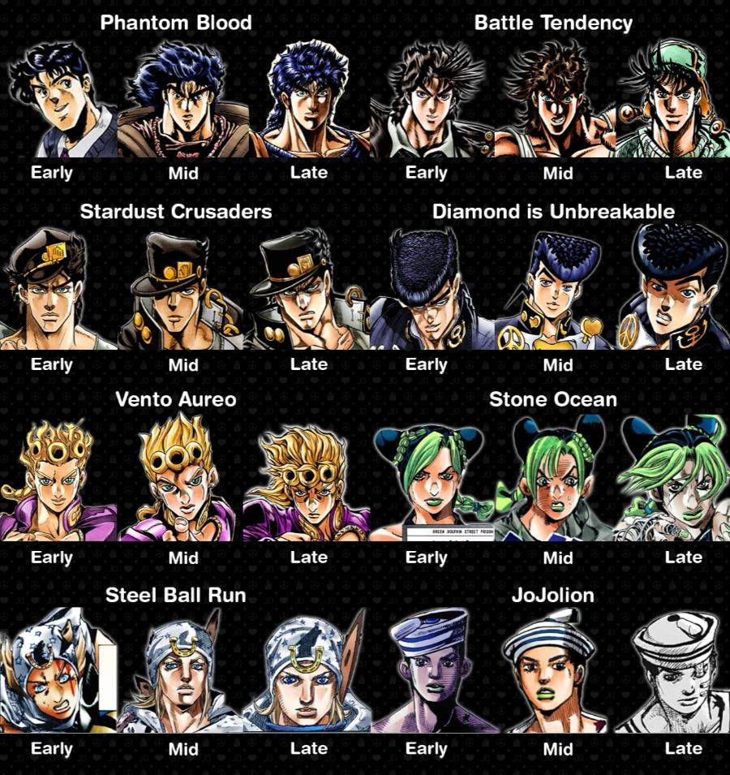
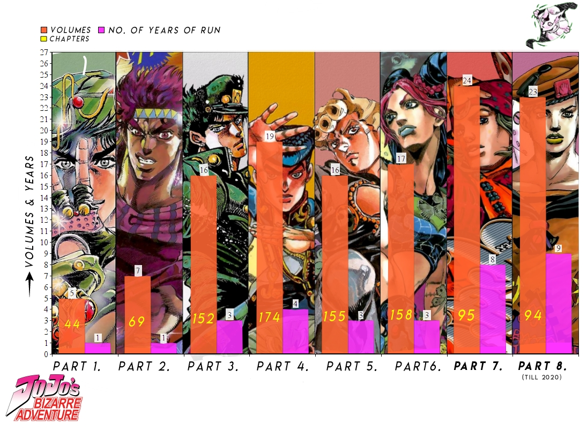
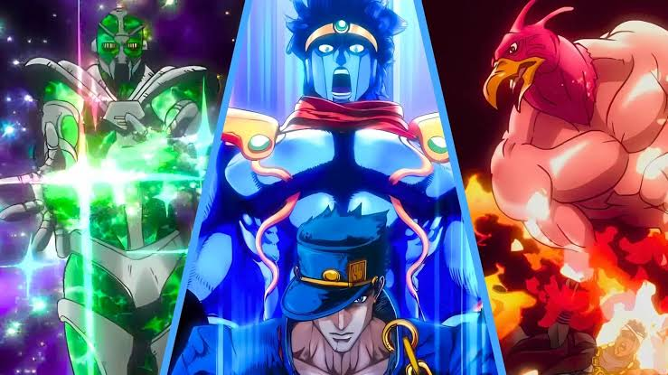
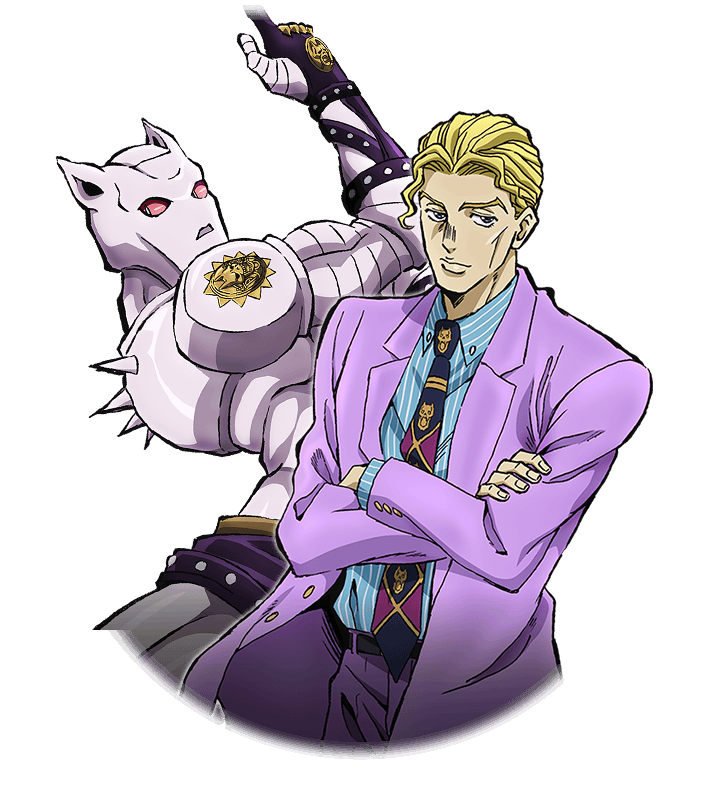
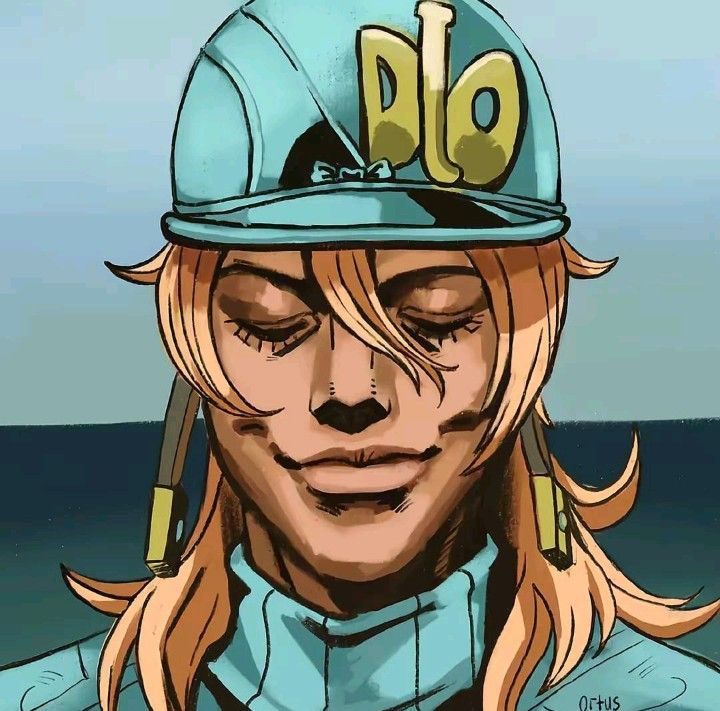

## Kenapa JoJo’s Bizarre Adventure adalah salah satu anime terbaik bagi Gua?

JoJo’s Bizarre Adventure… dari namanya saja pun sudah unik dan *straight forward*. Sesuai judulnya, anime ini menceritakan petualangan aneh dari seseorang (atau orang-orang) bernama JoJo.

https://indypl.bibliocommons.com/v2/list/display/1315807857/1864593319

Sejauh ini, animenya sudah ada 7 part, dan masih on going. Part 7 bakal ada episode baru tanggal 25 September 2026 nanti. Bahkan manganya pun masih berlanjut, update bulanan untuk part 9 yang lagi berjalan. Kalau dihitung dari awal manganya muncul tahun 1986, seri ini udah 40 tahun berjalan. Gila banget.

https://www.reddit.com/r/StardustCrusaders/comments/179qopn/whats_your_favorite_art_style_from_jjba/

Sebelum ngomongin plot ceritanya, ada satu hal yang langsung ketara ketika ngomongin JoJo, yaitu *art style*. Gaya gambar Hirohiko Araki sebagai mangaka JoJo tuh unik banget. Beda dengan style anime kebanyakaan saat ini. Garis-garis tegas, tubuh kekar berotot, sampai detail *fashion* setiap karakternya nyentrik banget.

https://www.reddit.com/r/StardustCrusaders/comments/hrovtz/jojo_graph_volume_run_span_and_chapters_of_all/

Sekarang mengenai ceritanya. *SPOILER ALERT*. Cerita yang dibawa dalam seri JoJo’s Bizarre Adventure memang tidak seberat atau sekompleks *Attack on Titan* (AoT salah satu anime yang gua suka banget juga, nanti kita bahas di tulisan lain), tapi JoJo punya cerita yang menurut gua asik banget untuk diikutin. Secara umum, JoJo ini menceritakan seorang protagonis yang berusaha keras untuk mencapai tujuan yang ingin ia capai. Tentu ada banyak halang rintang yang harus JoJo lewatin, termasuk mengalahkan *villain*. Setiap part punya protagonis, tujuan, dan villain yang berbeda beda. Tapi tiap part (kebanyakan) berhubungan dengan part lainnya, karena kontinuitas. Setelah part 1 selesai, part 2 adalah lanjutan dari part 1, kemudian part 3, part 4, hingga part 6. Pengecualian untuk part 7 karena ini ada universe yang berbeda.

https://encrypted-tbn0.gstatic.com/images?q=tbn:ANd9GcTYl30PGr2F-FaGLTrUi94awoIbuIlviAsBdeFpyG85SOp-d9zE-Jd-TCoF&s=10

Selain itu, sesuatu hal yang unik dan menarik banget dari seri JoJo ini adalah *power system*-nya. Ada 3 kekuatan yang umum dipakai di seri ini. Pertama hamon, kedua stand, dan ketiga spin.

1. Hamon diperkenalkan di part 1, kemudian masih dipakai di part 2 dan sedikit di part 3. Hamon ini singkatnya adalah kekuatan tubuh dari pernafasan yang dapat dialirkan ke berbagai media. Kekuatan ini dipakai karena efektif untuk melawan vampire di part 1 dan 3 serta *pillar men* di part 2.
2. Stand mulai diperkenalkan di part 3 dan dipakai terus di setiap part-nya. Ini *power system* yang paling menarik bagi gua. Stand ini singkatnya adalah manifestasi mental atau jiwa manusia yang hanya bisa diliat oleh orang sesama pengguna stand, basically bisa dibilang stand ini setara *khodam*. Kekuatan manifestasinya bisa dibilang *liar* karena macem-macem banget. Ada orang yang kekuatannya munculin wujud manusia setengah ayam yang bisa ngeluarin api, ada yang munculin wujud khodam berotot yang bisa mukul kenceng banget, sampe yang kekuatannya kompleks seperti mengembalikan aksi menjadi nol dan reset dunia. Kombat antar stand nya jadi dinamis karena penggunaan stand tergantung pada kreativitas penggunanya.
3. Spin dikenalkan di part 7. Singkatnya ini kekuatan muterin sesuatu, contohnya bola. udah gitu aja… tapi nanti diperlihatkan lebih dalam kompleksitas spin di sepanjang part 7.

[https://encrypted-tbn0.gstatic.com/images?q=tbn:ANd9GcTnfJX2ylmemODaqmm0hu9m1DwVxdftTJyyNYQDMAp2qQ&s=10](https://encrypted-tbn0.gstatic.com/images?q=tbn:ANd9GcTnfJX2ylmemODaqmm0hu9m1DwVxdftTJyyNYQDMAp2qQ&s=10)

Satu hal yang ingin gua bahas mengenai seri ini adalah *villain*-nya. Setiap part punya villain masing-masing. Dari sekian banyak villain tersebut, penulisannya menurut gua bagus banget. Mereka punya tujuan sendiri, berjuang untuk itu, tapi *clash* dengan protagonis kita. Salah satu villain terbaik adalah Kira Yoshikage di part 4, dia hanya ingin hidup tenang di kota morioh menurut versinya, tapi somehow dia jadi ancaman di kota tersebut. Gokil banget.

https://i.pinimg.com/736x/46/e9/2b/46e92b04e38611a5e10739ae9fc3ebf1.jpg

Overall, bagi gua, JoJo ini seri yang enjoyable banget untuk ditonton dan diikuti. Terutama karena konsep kontinuitasnya, kita dibuat penasaran dengan kelanjutan dari cerita yang sudah kita lihat sebelumnya. Menikmati penulisan karakter utama di sepanjang ceritanya, macam-macam masalah yang mereka lewati, perjuangan mereka mencapai tujuannya, sampai filosofi di dalamnya.

