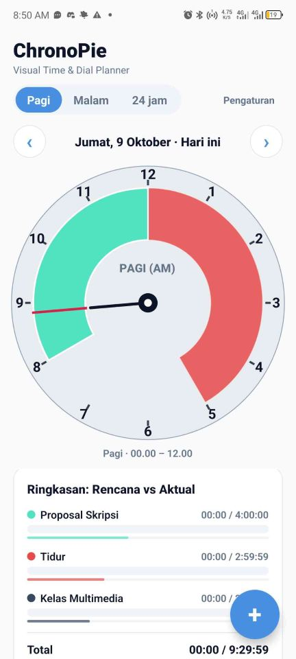

### Deksripsi Project

ChronoPie ini adalah aplikasi perencana waktu visual yang berbasis dial (lingkaran jam) untuk merencanakan, melacak, dan mengelola aktivitas harian. Aplikasi ini bisa menampilkan jadwal kegiatan dalam bentuk dial melingkar yang intuitif dengan tampilan AM/PM atau 24 jam, mendukung jadwal berulang (harian/mingguan), pelacakan waktu aktivitas, notifikasi pengingat, serta widget layar beranda.

### Tujuan Project

Membuat aplikasi mobile untuk melihat waktu sebagai sesuatu yang visual agar agenda harian bisa lebih terstruktur. Dirancang agar mudah dibaca dan mudah untuk menyusun agenda dengan cepat.

### Teknologi yang Digunakan

- React Native
- Type Script
- Expo Go
